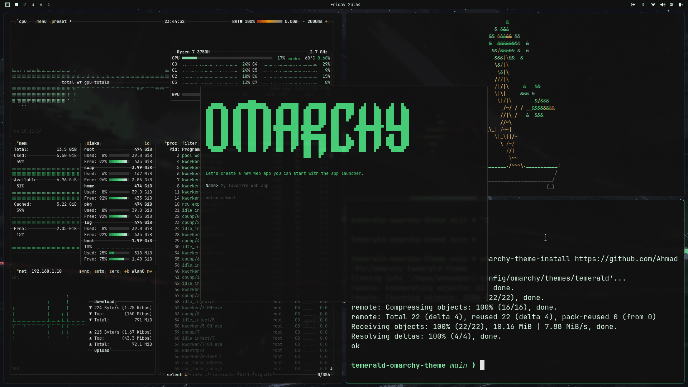

# Omarchy Temerald Theme




## TODOS
- [ ] use lutgen to create more bgs
- [ ] Previews 
- [ ] complete other terminals UI 
- [ ] finish vscode theme
- [ ] include color palette + desc
- [ ] finish nvim theme 
- [ ] customize waybar

## Installation
To install on Omarchy:
```sh
omarchy-theme-install https://github.com/Ahmad-Mtr/omarchy-temerald-theme
```


## Included configs
- Alacritty (alacritty.toml)
- btop (btop.theme)
- Hyprland (hyprland.conf, hyprlock.conf)
- Mako (mako.ini)
- Neovim (neovim.lua) `note: using temporarily Poimanders theme`
- Vscode (vscode.json) `note: same as neovim`
- Waybar (waybar.css)
- Wofi (wofi.css)
- Walker (walker.css)
- SwayOSD (swayosd.css)
- Desktop Background `backgrounds/`


## License
MIT
